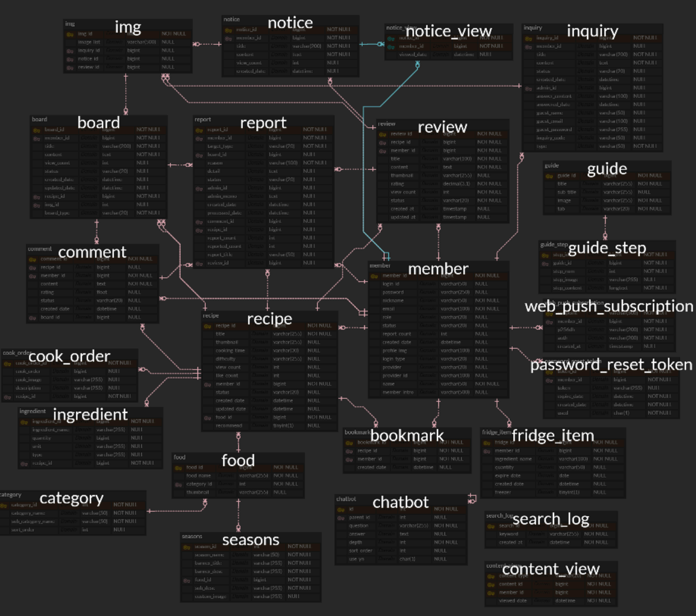
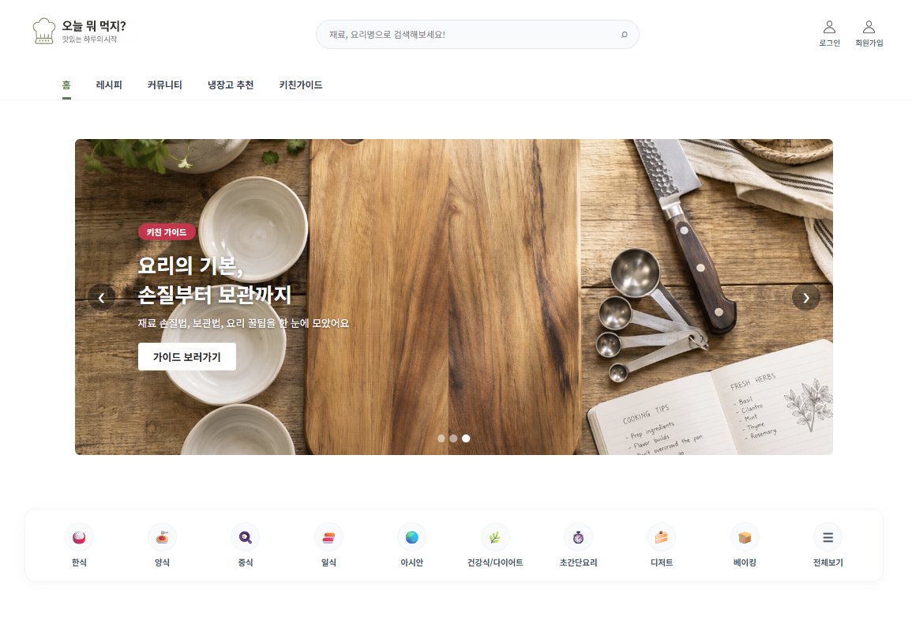
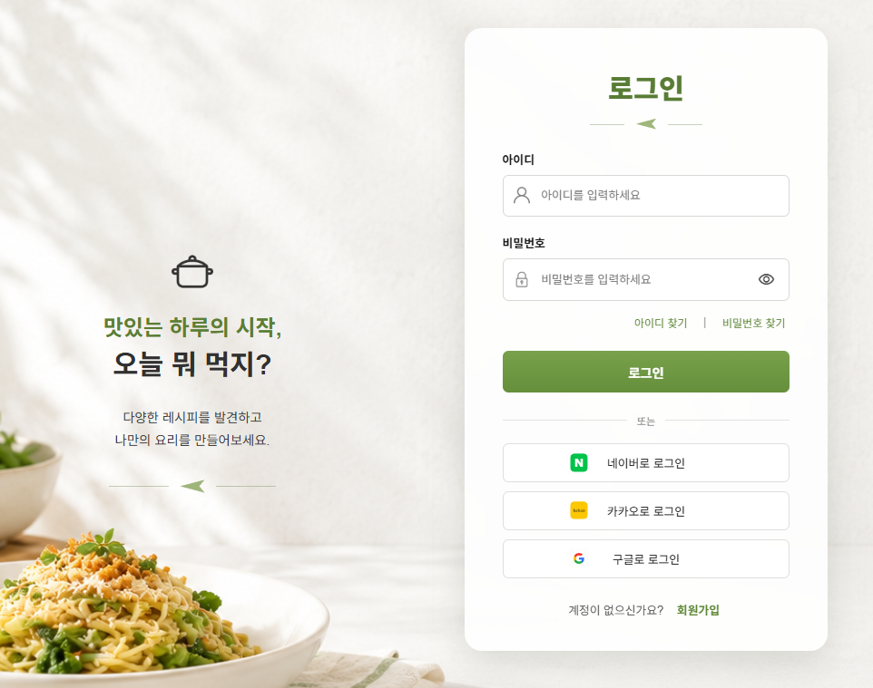
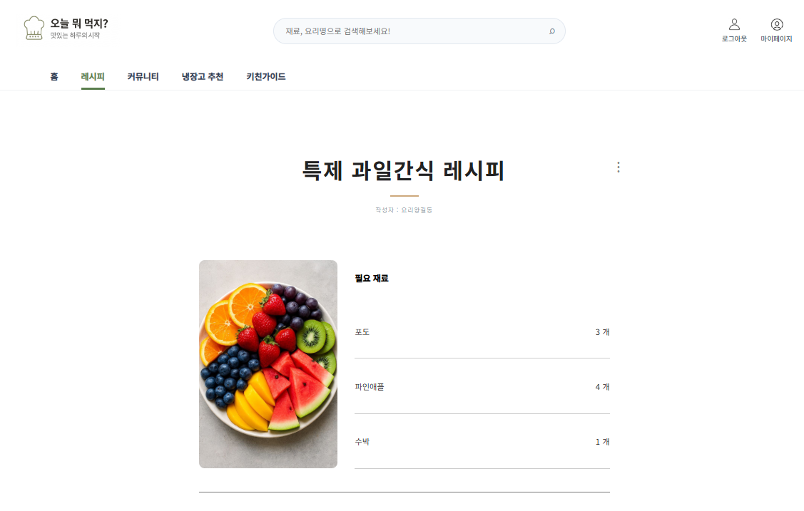
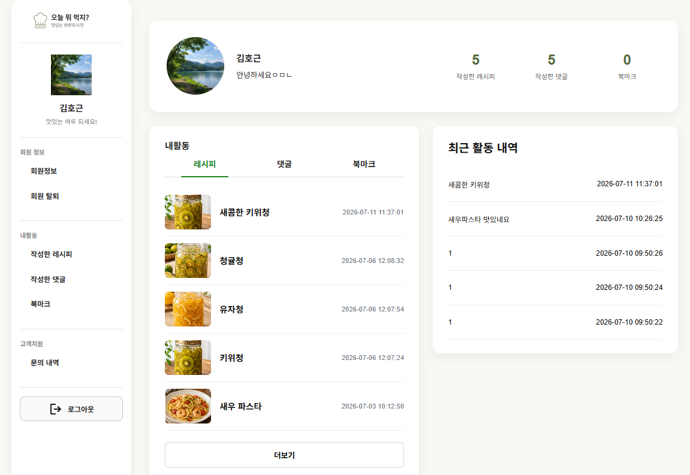
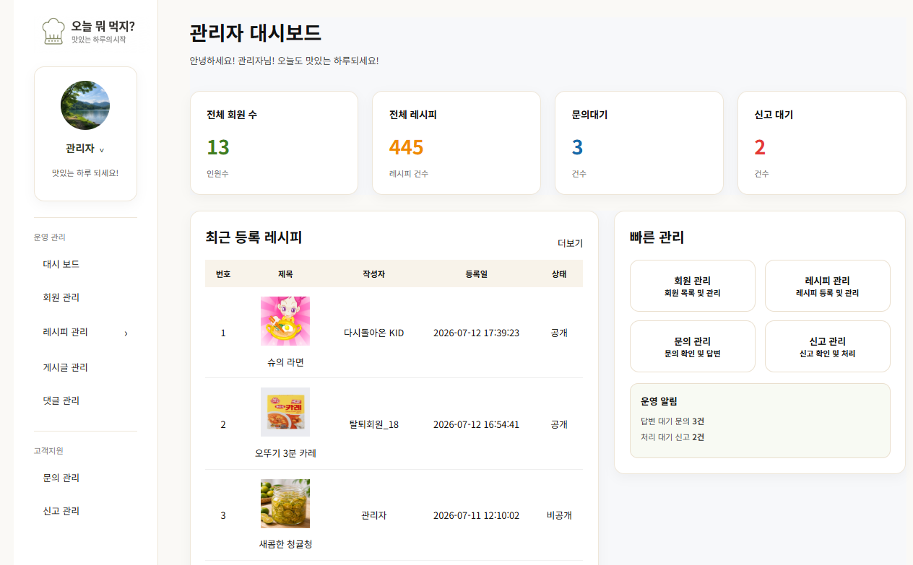

🍳 CookOrder

오늘 뭐 먹지?
사용자가 레시피를 검색하고 공유하며, 다양한 요리 정보를 함께 나눌 수 있는 레시피 커뮤니티 서비스입니다.

📌 프로젝트 정보
항목	내용
프로젝트명	CookOrder
개발 기간	2026.05.21 ~ 2026.07.13
개발 인원	5명 (팀 프로젝트)
개발 환경	Spring Boot, MyBatis, JSP, MySQL
배포 환경	AWS EC2, AWS RDS, Nginx, GitHub Actions

🛠 기술 스택

Backend

- Java 17
- Spring Boot
- Spring Security
- Spring OAuth2 Client
- MyBatis
- Gradle

Frontend

- JSP
- HTML5
- CSS3
- JavaScript
- Fetch API

Database

- MySQL
- AWS RDS

Infrastructure

- AWS EC2
- Nginx
- GitHub Actions

Tools

- Git
- GitHub
- DBeaver
- Figma

🏗 시스템 아키텍처

(시스템 아키텍처 이미지 삽입)
<pre>
Client
   │
   ▼
 Nginx
   │
   ▼
Spring Boot
   │
   ▼
 MySQL (AWS RDS)
</pre>

사용자의 요청은 AWS EC2에서 실행 중인 Nginx가 먼저 수신합니다.

Nginx는 Reverse Proxy 역할을 수행하여 Spring Boot 애플리케이션으로 요청을 전달하며, 애플리케이션은 AWS RDS(MySQL)와 데이터를 주고받아 처리 결과를 반환합니다.

🗄 ERD

이미지를 클릭하면 원본 크기로 확인할 수 있습니다.

주요 테이블
테이블	설명
Member	회원 및 소셜 로그인 정보
Recipe	레시피 정보
Cook_Order	조리 순서
Food	음식 정보
Category	카테고리
Comment	댓글
Review	후기 및 평점
Bookmark	북마크
Report	신고
Inquiry	문의
Img	다중 이미지

✨ 주요 기능
일반 로그인 및 OAuth2(구글, 카카오, 네이버) 로그인
이메일 인증을 통한 회원가입 및 계정 관리
레시피 등록, 수정, 삭제 및 검색
카테고리 및 키워드 기반 레시피 조회
조리 순서 및 다중 이미지 등록
댓글, 후기, 평점, 좋아요, 북마크 기능
마이페이지 및 회원 활동 관리
공개 회원 프로필 조회
관리자 대시보드
회원, 레시피, 문의 및 신고 관리
AWS EC2 · RDS · Nginx 기반 서비스 배포
GitHub Actions를 활용한 CI/CD 자동 배포

📸 실행 화면

메인 페이지

로그인

레시피 상세

마이페이지

관리자 페이지

🚀 CI/CD

(CI/CD 다이어그램 이미지 삽입)

Developer
      │
      ▼
 GitHub Push
      │
      ▼
 Pull Request
      │
      ▼
 Master Merge
      │
      ▼
 GitHub Actions
      │
      ▼
 Gradle Build
      │
      ▼
 EC2 Deploy
      │
      ▼
 Spring Boot Restart

GitHub Actions를 이용하여 master 브랜치에 코드가 병합되면 자동으로 프로젝트를 빌드하고 EC2 서버에 배포하도록 구성했습니다.

이를 통해 반복적인 수동 배포 과정을 제거하고 일관된 배포 환경을 구축했습니다.

⚡ 트러블 슈팅

1. GitHub Actions를 이용한 자동 배포 구축

문제

배포할 때마다 EC2 서버에 접속하여 빌드 파일을 업로드하고 애플리케이션을 재실행해야 했습니다.

원인

빌드, 파일 전송, 서버 실행 과정이 모두 수동으로 이루어지고 있었습니다.

해결

GitHub Actions를 이용하여 다음 과정을 자동화했습니다.

프로젝트 빌드
JAR 생성
EC2 전송
기존 프로세스 종료
신규 애플리케이션 실행

환경 설정과 SSH Key는 GitHub Secrets를 이용해 관리했습니다.

결과
배포 시간 단축
반복 작업 제거
배포 과정의 실수 감소

2. OAuth2 로그인 배포 환경 인증 실패

문제

Google, Kakao, Naver 로그인은 로컬에서는 정상 동작했지만 EC2 배포 환경에서는 인증이 실패했습니다.

원인

OAuth2 플랫폼에 등록된 Redirect URI가 로컬 주소만 등록되어 있었으며, 실제 배포 주소와 일치하지 않았습니다.

해결

각 플랫폼의 Redirect URI를 배포 환경에 맞게 등록하고 Spring Security 설정과 동일하게 수정했습니다.

결과
로컬 및 배포 환경 모두 정상 로그인
OAuth2 인증 과정과 Redirect URI의 중요성을 이해

3. 다중 이미지 업로드 시 413 오류

문제

레시피 등록 시 여러 장의 이미지를 업로드하면 413 Request Entity Too Large 오류가 발생했습니다.

원인

Spring Boot뿐 아니라 Nginx에서도 요청 크기를 제한하고 있었습니다.

해결

Spring Boot Multipart 설정과 함께 Nginx의 client_max_body_size 값을 수정했습니다.

spring.servlet.multipart.max-file-size=10MB
spring.servlet.multipart.max-request-size=100MB
client_max_body_size 100M;

결과

다중 이미지 정상 업로드
웹 서버와 애플리케이션 설정을 함께 고려하는 경험을 얻음

📖 프로젝트를 통해 배운 점

- Spring Security와 OAuth2를 활용한 인증 및 권한 처리 구조를 경험했습니다.
- MyBatis와 DTO를 활용하여 유지보수성을 고려한 코드 구조를 설계했습니다.
- AWS EC2, RDS, Nginx를 이용해 실제 서비스 배포 환경을 구축했습니다.
- GitHub Actions를 활용하여 CI/CD 자동 배포 환경을 구성했습니다.
- Git Flow와 Pull Request 기반 협업을 경험하며 팀 프로젝트 개발 프로세스를 익혔습니다.

🔗 관련 링크
GitHub : https://github.com/kimhoken/food-recipe-site
배포 주소 : (추가 예정)
발표 자료 : (추가 예정)